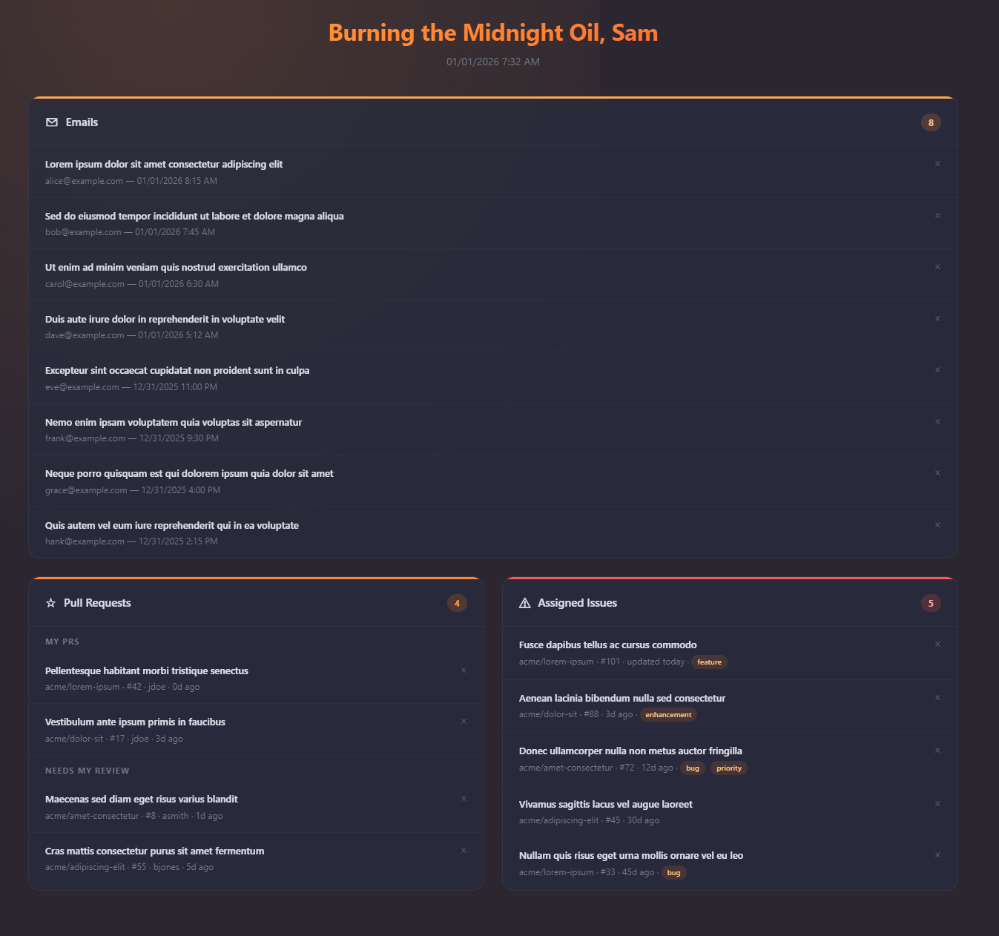

# Daily Dashboard

A personal dashboard that aggregates your work context from Microsoft 365 and GitHub into a single local view. Instead of being a standalone app, the dashboard is driven by a **Claude Code workflow**: Claude fetches your latest data, writes it to a set of small JavaScript files, and a static HTML template stitches them together into a clean, glanceable page.



*The generated dashboard: unread email, your PR queue, and assigned issues at a glance (shown with placeholder data).*

Run it whenever you want a fresh read on your day, and let the Windows scheduled task refresh it automatically on weekday mornings.

## What It Does

When you tell Claude Code to **"Run the morning briefing"**, it spins up three agents in parallel — one per data source — and surfaces:

| Source | Data |
|--------|------|
| **Microsoft 365 Mail** | Your 25 most recent unread emails (AI code-review bot noise filtered out) |
| **GitHub Pull Requests** | Open PRs you authored *and* PRs that involve you (split into "My PRs" and "Needs My Review") |
| **GitHub Issues** | All open issues currently assigned to you, across every accessible repo |

Each item is rendered in a local dashboard with click-through links to the original, per-day dismiss tracking, and a time-of-day-aware greeting — so you can triage without jumping between tabs.

## How It Works

The project has no build step, server, or runtime framework. The moving parts are:

```
"Run the morning briefing"  →  Claude Code (CLAUDE.md workflow)
        │
        ├─ Agent 1 ── M365 email search (MCP) ──→ dashboard/data/emails.js
        ├─ Agent 2 ── gh api (PRs)            ──→ dashboard/data/prs.js
        └─ Agent 3 ── gh api (issues)         ──→ dashboard/data/issues.js
                                                       │
   Orchestrator ── writes dashboard/data/meta.js (last) ─┘
                                                          │
   dashboard/template/template.html ── polls data/meta.js, reloads in place on change
```

1. **`CLAUDE.md`** defines the briefing workflow. Each agent deletes its target data file and writes a fresh one — it never returns JSON to the orchestrator. The briefing **does not open a browser**: under all-day polling it runs windowless and headless, so opening one would be disruptive.
2. **`dashboard/template/template.html`** is a no-build page (vanilla HTML/CSS/JS) that links the shared `../css/styles.css`, `../renderers.js`, and `../behavior.js`. On load it reads the four `data/*.js` files, each of which assigns a global (`window.BRIEFING_EMAILS`, `window.BRIEFING_PRS`, `window.BRIEFING_ISSUES`, `window.BRIEFING_META`), and stitches them into `window.BRIEFING_DATA` for rendering. It then **polls `data/meta.js` once a minute** and, when `generatedAt` changes, reloads all data files and re-renders in place — preserving scroll and dismissed state — so a dashboard left open on a spare screen stays current all day.
3. The generated `data/*.js` files are **git-ignored** — they hold your live personal data and are regenerated on every run.

### Data sources in detail

- **Email** is fetched via the Microsoft 365 MCP tool (`outlook_email_search`) using the query `isRead:false NOT body:"claude[bot]" NOT body:"@Copilot"`, which drops `claude[bot]` and `@Copilot` automated PR-review comments while keeping human messages.
- **PRs and issues** come from `gh api search/issues` (the GitHub CLI), not `gh search`, which returns empty under OAuth tokens. The queries are scoped to a specific GitHub login — see [Configuration](#configuration) to point them at your own account.

## Tech Stack

| Layer | Choice |
|-------|--------|
| Orchestration | Claude Code CLI (`claude`) driven by the `CLAUDE.md` workflow |
| Dashboard UI | Static `template/template.html` — vanilla HTML/CSS/JS, no framework, no build |
| Data files | Generated `data/*.js` files assigning `window.BRIEFING_*` globals |
| Email source | Microsoft 365 MCP server (`outlook_email_search`) |
| GitHub source | GitHub CLI (`gh api`) |
| Scheduler | Windows Task Scheduler, configured via PowerShell |

## Repository Layout

```
CLAUDE.md                  The morning-briefing workflow Claude executes
config/schedule.json       Polling schedule: start/end time, interval, days of week
scripts/register-task.ps1  Register / update / unregister the scheduled task
scripts/start-session.ps1  Launches a headless Claude Code briefing session (logged)
scripts/open-dashboard.ps1 Opens the dashboard once in the interactive session
dashboard/template/template.html  The dashboard page (open this to view your briefing)
dashboard/template/template.js    Live-page bootstrap: data wiring, render, auto-reload
dashboard/preview/preview.html    Static design preview with no live data
dashboard/preview/preview.js      Preview bootstrap: render the bundled sample data
dashboard/css/styles.css          Shared stylesheet linked by both pages
dashboard/css/preview.css         Preview-only style overrides (flat background + glows)
dashboard/renderers.js            Shared rendering (html`` escaper + email/PR/issue renderers)
dashboard/behavior.js             Shared runtime: greeting, delegated dismiss, badges, section collapse, keyboard nav
dashboard/test-data.js            Sample data for previewing the layout
dashboard/data/*.js               Generated live data (git-ignored; folder kept + documented via data/README.md)
logs/                      start-session.ps1 run logs (git-ignored)
WorkingFiles/              Free-form notes / General Logs.txt (git-ignored)
```

## Setup

### Prerequisites

- **Claude Code CLI** — `npm install -g @anthropic-ai/claude-code`
- **GitHub CLI** — installed and authenticated: `gh auth login`
- **Microsoft 365 account** connected to Claude via the Microsoft 365 MCP server (provides `outlook_email_search`)
- **Windows** with PowerShell (for the optional scheduled task)

No language runtime, package install, or build is required — the dashboard is a static file.

### Quick Start

```powershell
# Clone the repo
git clone https://github.com/SamuelBostic29/Daily-Dashboard.git
cd Daily-Dashboard

# Launch Claude Code in the project directory, then prompt:
#   Run the morning briefing
# Claude fetches your data and writes dashboard/data/*.js.

# Open the dashboard once (it auto-reloads as new data arrives):
.\scripts\open-dashboard.ps1
```

To preview the layout without any live data, just open `dashboard/preview/preview.html` — it renders the bundled sample data in `dashboard/test-data.js`.

### Configuration

The GitHub queries in `CLAUDE.md` are scoped to a specific account. To use your own, update the login in both `gh api` queries:

- PRs: `involves:SBosticParadigm` → `involves:<your-login>`
- Issues: `assignee:SBosticParadigm` → `assignee:<your-login>`

The greeting name is the `USER_NAME` constant at the top of `dashboard/behavior.js`.

### Scheduling automatic refreshes

`config/schedule.json` controls when the briefing runs automatically:

```json
{
  "daysOfWeek": ["Monday", "Tuesday", "Wednesday", "Thursday", "Friday"],
  "startTime": "07:30",
  "endTime": "17:30",
  "intervalMinutes": 30
}
```

The task fires at `startTime`, then repeats every `intervalMinutes` until `endTime` — an all-day live agenda rather than a one-shot morning snapshot. Omit `intervalMinutes` (or set the legacy `time` key) to fall back to a single daily run.

Register the Windows scheduled task (runs `scripts/start-session.ps1`, which launches a headless Claude Code session and logs to `logs/startup.log`):

```powershell
.\scripts\register-task.ps1                  # register
.\scripts\register-task.ps1 -Action update   # apply schedule.json changes
.\scripts\register-task.ps1 -Action unregister
```

The task runs **only while you're logged on** (no admin rights needed to register). Each poll launches windowless via `conhost.exe --headless powershell.exe -WindowStyle Hidden`, so no console flashes across your screen. It uses `StartWhenAvailable`, so a run missed because the machine was asleep fires when it next can. Because automated runs are unattended, `start-session.ps1` invokes Claude headless (`claude -p`) with `--dangerously-skip-permissions`.

The polls only regenerate the data files — they don't open a browser. Open the dashboard once a day with `scripts/open-dashboard.ps1` (e.g. a Stream Deck shortcut, which also makes it easy to reopen if you close it); it auto-reloads in place as each poll produces fresh data.

## License

MIT
